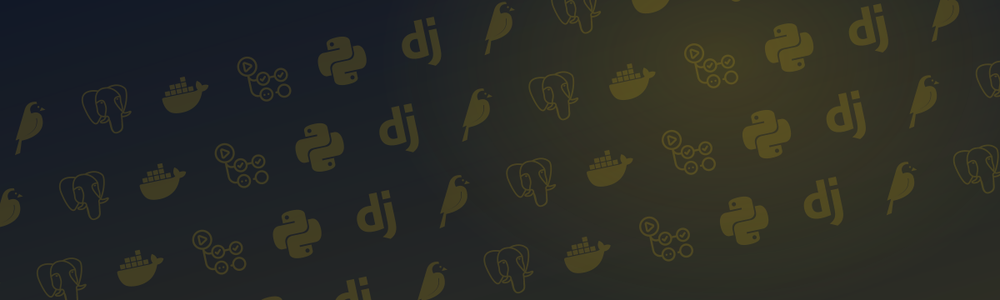

<p align="center">
  
</p>

<p align="center">
  <br>
</p>

<h1 align="center">Personal Django Portfolio Web</h1>

<p align="center">Django and Wagtail backend for a separately maintained React portfolio.</p>

<p align="center">
  <a href="https://github.com/pianic2/personal-django-portfolio-web/actions/workflows/quality.yml"></a>
  <a href="LICENSE"></a>
</p>

## Quick start

Requires Python `>=3.13,<3.14`, [`uv`](https://docs.astral.sh/uv/), and Docker Compose. The backend uses Django 5.2.17, Wagtail 8.0, and PostgreSQL.

```bash
uv sync --frozen
cp .env.example .env
docker compose up -d postgres
uv run python manage.py migrate
uv run python manage.py runserver
```

## Backend interfaces

| Consumer | Backend interface | Purpose |
| --- | --- | --- |
| React portfolio | Wagtail v3 API, `/api/contact/` | Published portfolio content and contact form |
| MCP clients | `/mcp` | Allowlisted draft content and media operations |
| Editors | `/admin/`, `/django-admin/` | Wagtail content editing; Django admin manages standalone capability records |

The backend owns bilingual Italian and English content. The React application is maintained separately and is not included here.

## Development and testing

Run a focused test with `uv run pytest path/to/test_file.py -q`, or run the full suite with `uv run pytest -q`. The canonical quality gate also runs Ruff, Django checks, and migration drift validation:

```bash
bash scripts/quality.sh
```

For setup details and configuration, see [Development](docs/development.md). The [Testing guide](docs/testing.md) documents targeted and full test commands.

## Documentation

- [Architecture and domain overview](docs/architecture.md)
- [Models and content model](docs/models.md)
- [API and integration contracts](docs/api.md)
- [Development and configuration](docs/development.md)
- [Testing and validation](docs/testing.md)
- [Operations and management commands](docs/operations.md)

## License

[MIT](LICENSE)
